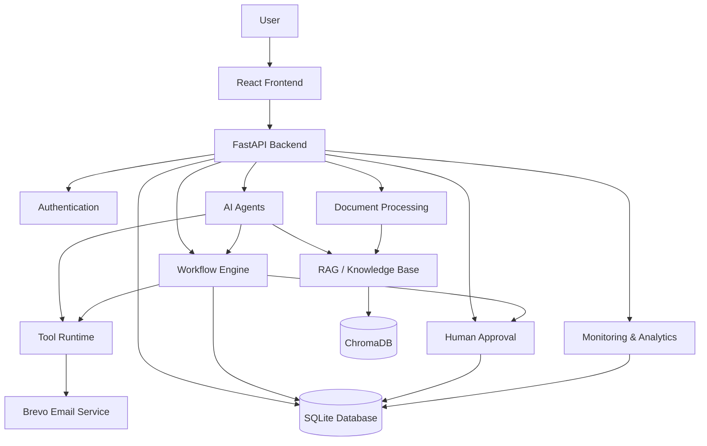
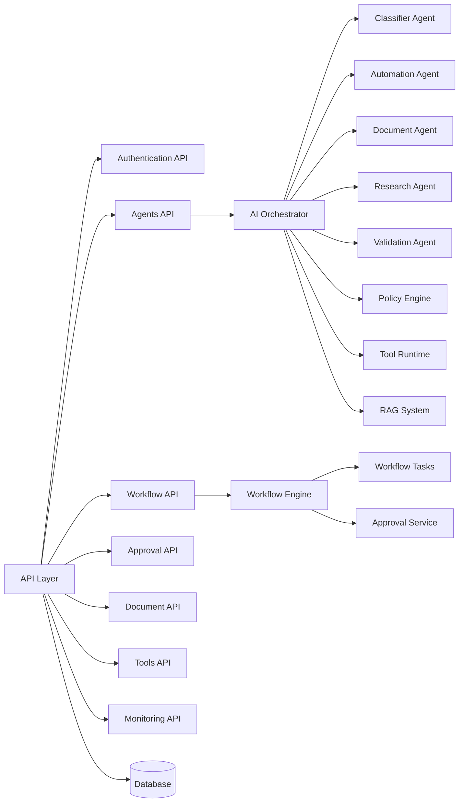
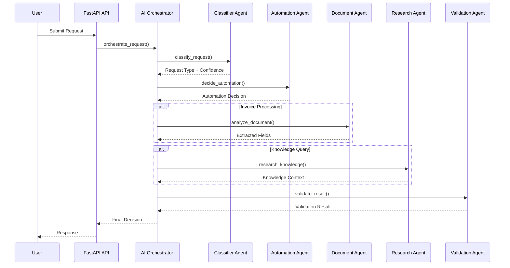
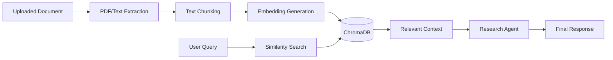
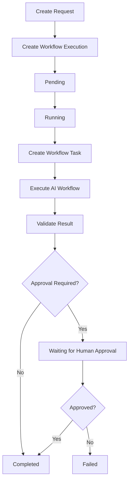
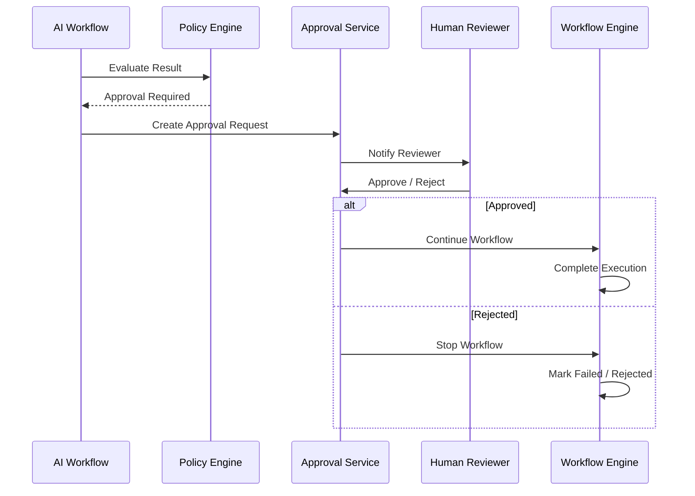

# AURIXA Architecture Documentation

## 1. High-Level Architecture Diagram

---

# 2. Component Architecture

---

# 3. Agent Communication Diagram

---

# 4. RAG Data Flow Diagram

---

# 5. Workflow Execution Diagram

---

# 6. Human Approval Diagram

---

# 7. Data Lifecycle Diagram

```mermaid
flowchart LR
    Input[User Request / Document]
    Validate[Prompt & Input Validation]
    Store[Database Storage]
    Process[AI Processing]
    Workflow[Workflow Execution]
    Approval[Human Approval]
    Result[Final Result]
    Audit[Audit Log]
    Monitor[Monitoring & Analytics]

    Input --> Validate
    Validate --> Store
    Store --> Process
    Process --> Workflow
    Workflow --> Approval
    Approval --> Result

    Workflow --> Audit
    Result --> Audit
    Audit --> Monitor
```

---

# Architecture Summary

AURIXA is an Autonomous Enterprise AI Platform built with:

- **Frontend:** React + Vite
- **Backend:** FastAPI
- **Database:** SQLite with SQLAlchemy Async
- **AI Architecture:** Multi-Agent Orchestration
- **RAG:** ChromaDB Knowledge Retrieval
- **Workflow Engine:** Custom asynchronous workflow execution
- **Human-in-the-Loop:** Approval system
- **Email Notifications:** Brevo
- **Security:** Prompt validation and authentication
- **Monitoring:** Request, workflow, and approval monitoring
- **Auditability:** Audit logs and workflow execution tracking